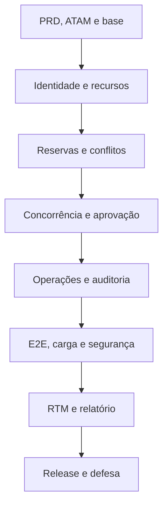

# Planejamento de Execução

> Baseline reavaliada em 25/08/2026 após a leitura da especificação e de todos os materiais fornecidos. Nenhuma tarefa está atribuída até os quatro integrantes entrarem e aprovarem a divisão.

## Capacidade verificada

- Issues abertas: **110**.
- Pontos planejados: **584**.
- Trabalho até a entrega da semana 46: **552 pontos**.
- Trabalho pós-entrega, semanas 47 a 50: **32 pontos**.
- Semanas ativas até a entrega: **12**; a semana 38 é reservada à prova escrita.
- Média necessária da equipe: **46,0 pontos por semana ativa**.
- Referência após divisão: **11,5 pontos por integrante/semana**.
- Faixa normal: **40–50 pontos**; semana 42 possui **51** por reunir concorrência e carga.
- Semanas 45–46 concentram fechamento e buffer; trabalho funcional não deve ser adiado para a semana 46 por conveniência.
- Epics coordenadoras #46, #47 e #56 permanecem com 0 ponto para evitar dupla contagem.

A estimativa é hipótese. Após duas semanas de execução, recalcular velocidade pela média realmente concluída. Não reduzir escopo obrigatório para “caber” no número.

## Alerta de recuperação

A baseline está na semana 35. As tarefas da semana 34 ainda abertas somam **54 pontos atrasados** e não podem ser marcadas como concluídas sem evidência. A recuperação começa por ambiente, PRD, ATAM, riscos e governança; telas dependentes foram movidas para depois do backend e da autorização.

## Cronograma por semana

| Semana | Período de 2026 | Pontos | Issues |
|---:|---|---:|---|
| 34 | 17/08–23/08 | 54 | [#1](https://github.com/pedrobertanhi/gerenciadordesalas/issues/1), [#2](https://github.com/pedrobertanhi/gerenciadordesalas/issues/2), [#3](https://github.com/pedrobertanhi/gerenciadordesalas/issues/3), [#4](https://github.com/pedrobertanhi/gerenciadordesalas/issues/4), [#5](https://github.com/pedrobertanhi/gerenciadordesalas/issues/5), [#6](https://github.com/pedrobertanhi/gerenciadordesalas/issues/6), [#7](https://github.com/pedrobertanhi/gerenciadordesalas/issues/7), [#8](https://github.com/pedrobertanhi/gerenciadordesalas/issues/8), [#9](https://github.com/pedrobertanhi/gerenciadordesalas/issues/9), [#10](https://github.com/pedrobertanhi/gerenciadordesalas/issues/10), [#58](https://github.com/pedrobertanhi/gerenciadordesalas/issues/58), [#60](https://github.com/pedrobertanhi/gerenciadordesalas/issues/60), [#90](https://github.com/pedrobertanhi/gerenciadordesalas/issues/90), [#92](https://github.com/pedrobertanhi/gerenciadordesalas/issues/92) |
| 35 | 24/08–30/08 | 41 | [#15](https://github.com/pedrobertanhi/gerenciadordesalas/issues/15), [#16](https://github.com/pedrobertanhi/gerenciadordesalas/issues/16), [#17](https://github.com/pedrobertanhi/gerenciadordesalas/issues/17), [#18](https://github.com/pedrobertanhi/gerenciadordesalas/issues/18), [#48](https://github.com/pedrobertanhi/gerenciadordesalas/issues/48), [#95](https://github.com/pedrobertanhi/gerenciadordesalas/issues/95), [#99](https://github.com/pedrobertanhi/gerenciadordesalas/issues/99), [#100](https://github.com/pedrobertanhi/gerenciadordesalas/issues/100), [#101](https://github.com/pedrobertanhi/gerenciadordesalas/issues/101) |
| 36 | 31/08–06/09 | 46 | [#11](https://github.com/pedrobertanhi/gerenciadordesalas/issues/11), [#12](https://github.com/pedrobertanhi/gerenciadordesalas/issues/12), [#19](https://github.com/pedrobertanhi/gerenciadordesalas/issues/19), [#55](https://github.com/pedrobertanhi/gerenciadordesalas/issues/55), [#64](https://github.com/pedrobertanhi/gerenciadordesalas/issues/64), [#86](https://github.com/pedrobertanhi/gerenciadordesalas/issues/86), [#91](https://github.com/pedrobertanhi/gerenciadordesalas/issues/91), [#93](https://github.com/pedrobertanhi/gerenciadordesalas/issues/93), [#109](https://github.com/pedrobertanhi/gerenciadordesalas/issues/109) |
| 37 | 07/09–13/09 | 47 | [#13](https://github.com/pedrobertanhi/gerenciadordesalas/issues/13), [#14](https://github.com/pedrobertanhi/gerenciadordesalas/issues/14), [#23](https://github.com/pedrobertanhi/gerenciadordesalas/issues/23), [#24](https://github.com/pedrobertanhi/gerenciadordesalas/issues/24), [#45](https://github.com/pedrobertanhi/gerenciadordesalas/issues/45), [#52](https://github.com/pedrobertanhi/gerenciadordesalas/issues/52), [#94](https://github.com/pedrobertanhi/gerenciadordesalas/issues/94), [#103](https://github.com/pedrobertanhi/gerenciadordesalas/issues/103) |
| 38 | 14/09–20/09 | 0 | Prova escrita; sem incremento técnico obrigatório |
| 39 | 21/09–27/09 | 46 | [#26](https://github.com/pedrobertanhi/gerenciadordesalas/issues/26), [#27](https://github.com/pedrobertanhi/gerenciadordesalas/issues/27), [#28](https://github.com/pedrobertanhi/gerenciadordesalas/issues/28), [#29](https://github.com/pedrobertanhi/gerenciadordesalas/issues/29), [#30](https://github.com/pedrobertanhi/gerenciadordesalas/issues/30), [#31](https://github.com/pedrobertanhi/gerenciadordesalas/issues/31), [#53](https://github.com/pedrobertanhi/gerenciadordesalas/issues/53), [#59](https://github.com/pedrobertanhi/gerenciadordesalas/issues/59), [#102](https://github.com/pedrobertanhi/gerenciadordesalas/issues/102) |
| 40 | 28/09–04/10 | 49 | [#25](https://github.com/pedrobertanhi/gerenciadordesalas/issues/25), [#41](https://github.com/pedrobertanhi/gerenciadordesalas/issues/41), [#42](https://github.com/pedrobertanhi/gerenciadordesalas/issues/42), [#49](https://github.com/pedrobertanhi/gerenciadordesalas/issues/49), [#68](https://github.com/pedrobertanhi/gerenciadordesalas/issues/68), [#70](https://github.com/pedrobertanhi/gerenciadordesalas/issues/70), [#96](https://github.com/pedrobertanhi/gerenciadordesalas/issues/96), [#104](https://github.com/pedrobertanhi/gerenciadordesalas/issues/104), [#110](https://github.com/pedrobertanhi/gerenciadordesalas/issues/110) |
| 41 | 05/10–11/10 | 49 | [#21](https://github.com/pedrobertanhi/gerenciadordesalas/issues/21), [#22](https://github.com/pedrobertanhi/gerenciadordesalas/issues/22), [#34](https://github.com/pedrobertanhi/gerenciadordesalas/issues/34), [#35](https://github.com/pedrobertanhi/gerenciadordesalas/issues/35), [#51](https://github.com/pedrobertanhi/gerenciadordesalas/issues/51), [#61](https://github.com/pedrobertanhi/gerenciadordesalas/issues/61), [#63](https://github.com/pedrobertanhi/gerenciadordesalas/issues/63), [#67](https://github.com/pedrobertanhi/gerenciadordesalas/issues/67), [#105](https://github.com/pedrobertanhi/gerenciadordesalas/issues/105) |
| 42 | 12/10–18/10 | 51 | [#20](https://github.com/pedrobertanhi/gerenciadordesalas/issues/20), [#32](https://github.com/pedrobertanhi/gerenciadordesalas/issues/32), [#33](https://github.com/pedrobertanhi/gerenciadordesalas/issues/33), [#54](https://github.com/pedrobertanhi/gerenciadordesalas/issues/54), [#65](https://github.com/pedrobertanhi/gerenciadordesalas/issues/65), [#69](https://github.com/pedrobertanhi/gerenciadordesalas/issues/69), [#106](https://github.com/pedrobertanhi/gerenciadordesalas/issues/106) |
| 43 | 19/10–25/10 | 44 | [#36](https://github.com/pedrobertanhi/gerenciadordesalas/issues/36), [#37](https://github.com/pedrobertanhi/gerenciadordesalas/issues/37), [#38](https://github.com/pedrobertanhi/gerenciadordesalas/issues/38), [#39](https://github.com/pedrobertanhi/gerenciadordesalas/issues/39), [#40](https://github.com/pedrobertanhi/gerenciadordesalas/issues/40), [#87](https://github.com/pedrobertanhi/gerenciadordesalas/issues/87), [#88](https://github.com/pedrobertanhi/gerenciadordesalas/issues/88) |
| 44 | 26/10–01/11 | 47 | [#43](https://github.com/pedrobertanhi/gerenciadordesalas/issues/43), [#44](https://github.com/pedrobertanhi/gerenciadordesalas/issues/44), [#50](https://github.com/pedrobertanhi/gerenciadordesalas/issues/50), [#71](https://github.com/pedrobertanhi/gerenciadordesalas/issues/71), [#72](https://github.com/pedrobertanhi/gerenciadordesalas/issues/72), [#85](https://github.com/pedrobertanhi/gerenciadordesalas/issues/85), [#97](https://github.com/pedrobertanhi/gerenciadordesalas/issues/97) |
| 45 | 02/11–08/11 | 50 | [#46](https://github.com/pedrobertanhi/gerenciadordesalas/issues/46), [#47](https://github.com/pedrobertanhi/gerenciadordesalas/issues/47), [#57](https://github.com/pedrobertanhi/gerenciadordesalas/issues/57), [#62](https://github.com/pedrobertanhi/gerenciadordesalas/issues/62), [#73](https://github.com/pedrobertanhi/gerenciadordesalas/issues/73), [#77](https://github.com/pedrobertanhi/gerenciadordesalas/issues/77), [#80](https://github.com/pedrobertanhi/gerenciadordesalas/issues/80), [#89](https://github.com/pedrobertanhi/gerenciadordesalas/issues/89), [#98](https://github.com/pedrobertanhi/gerenciadordesalas/issues/98), [#107](https://github.com/pedrobertanhi/gerenciadordesalas/issues/107), [#108](https://github.com/pedrobertanhi/gerenciadordesalas/issues/108) |
| 46 | 09/11–15/11 | 28 | [#56](https://github.com/pedrobertanhi/gerenciadordesalas/issues/56), [#66](https://github.com/pedrobertanhi/gerenciadordesalas/issues/66), [#75](https://github.com/pedrobertanhi/gerenciadordesalas/issues/75), [#78](https://github.com/pedrobertanhi/gerenciadordesalas/issues/78), [#82](https://github.com/pedrobertanhi/gerenciadordesalas/issues/82), [#83](https://github.com/pedrobertanhi/gerenciadordesalas/issues/83) |
| 47 | 16/11–22/11 | 8 | [#79](https://github.com/pedrobertanhi/gerenciadordesalas/issues/79) |
| 48 | 23/11–29/11 | 11 | [#74](https://github.com/pedrobertanhi/gerenciadordesalas/issues/74), [#76](https://github.com/pedrobertanhi/gerenciadordesalas/issues/76) |
| 49 | 30/11–06/12 | 8 | [#81](https://github.com/pedrobertanhi/gerenciadordesalas/issues/81) |
| 50 | 07/12–13/12 | 5 | [#84](https://github.com/pedrobertanhi/gerenciadordesalas/issues/84) |

## Razões do replanejamento

- #45 passou para a semana 37, quando a autorização base já deve existir.
- #63 passou para a semana 41.
- #62 passou para a semana 45.
- #66 e #75 passaram para a semana 46.
- #85 passou para a semana 44.
- #99–#110 cobrem PRD, ATAM, casos reproduzíveis, técnicas de teste, CI vermelho→verde, integração segura, TDD/BDD, RNFs de carga, auditoria da RTM, prova oral, SQA e testes negativos de vazamento.

## Caminho crítico

Uma tarefa não entra em **Ready** com dependência obrigatória aberta.

## Regras do quadro

| Status | Condição obrigatória |
|---|---|
| Backlog | Tarefa conhecida e ainda não preparada |
| Ready | Dependências concluídas, aceite, teste, risco e evidência definidos |
| In progress | Responsável e branch existentes; uma Issue principal por integrante |
| In review | PR aberto, pipeline executado, documentação/RTM atualizadas em commits próprios |
| Done | Revisão aprovada, merge sem squash e evidência do mesmo commit/tag |

## Definition of Ready

- [ ] Objetivo, escopo, critérios e dados concretos.
- [ ] Dependências concluídas.
- [ ] Técnica e nível de teste definidos.
- [ ] Risco, segurança e efeito ausente avaliados.
- [ ] Evidência esperada e estimativa revisadas.
- [ ] Responsável definido apenas depois da divisão oficial.

## Definition of Done

- [ ] Cada alteração concluída em um arquivo possui commit próprio.
- [ ] Alterações independentes no mesmo arquivo possuem commits separados.
- [ ] Código, teste, configuração, documento e evidência estão separados.
- [ ] Testes relevantes e `./mvnw -B verify` estão verdes.
- [ ] JaCoCo, SonarCloud e verificações de segurança aplicáveis passam.
- [ ] Não há bug nem vulnerabilidade crítica confirmada e aberta.
- [ ] RTM, riscos, defeitos e evidências apontam para o mesmo commit.
- [ ] PR foi revisado por outro integrante e integrado sem squash.

## Gate de segurança

A release é reprovada por vulnerabilidade crítica, segredo confirmado, autorização quebrada, dupla reserva, scanner crítico não triado ou evidência de outro commit. O gate inclui SCA/dependency review, CodeQL, secret scanning/push protection, Trivy, ZAP, testes de autorização e testes de ausência em respostas/logs (#92–#98 e #110).

## Divisão futura entre quatro integrantes

1. Esperar todos entrarem.
2. Cada pessoa recebe tarefas relevantes de Java e testes, não apenas documentação.
3. Segurança, concorrência, CI e rastreabilidade são distribuídas.
4. Pontos e criticidade são equilibrados usando velocidade real.
5. Cada pessoa abre PR próprio e revisa PR de outra.
6. Autoria é comprovada por commits e PRs preservados, sem squash.
7. A divisão aprovada é registrada em `docs/equipe/AUTORIA.md` e no GitHub Project.

## Regra de replanejamento

Mudança de semana, escopo, risco ou estimativa deve atualizar a Issue e este arquivo em commit próprio. Resultado inexistente permanece **pendente**, nunca “aprovado”.
