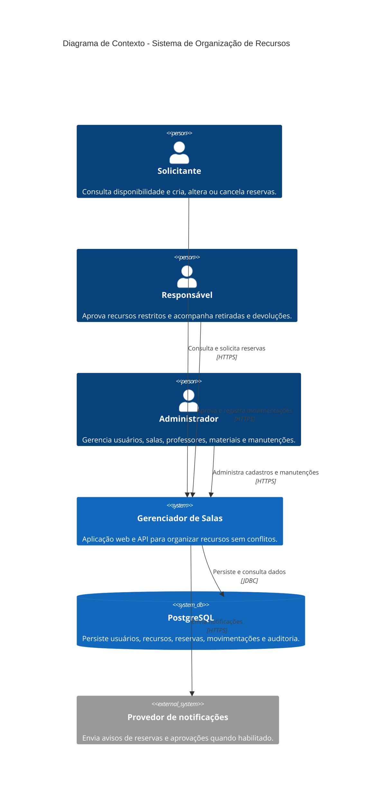
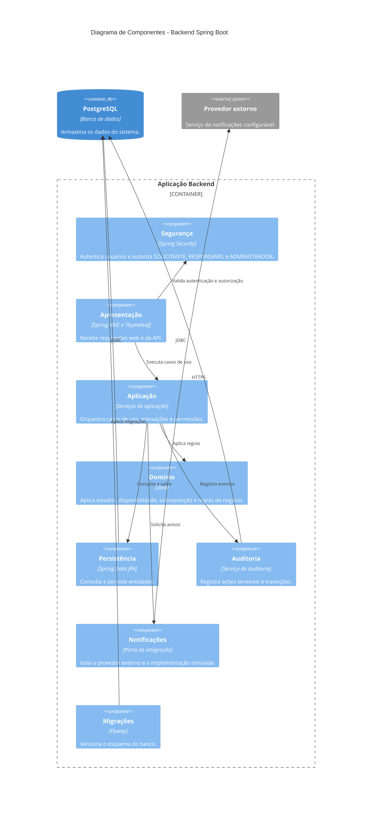
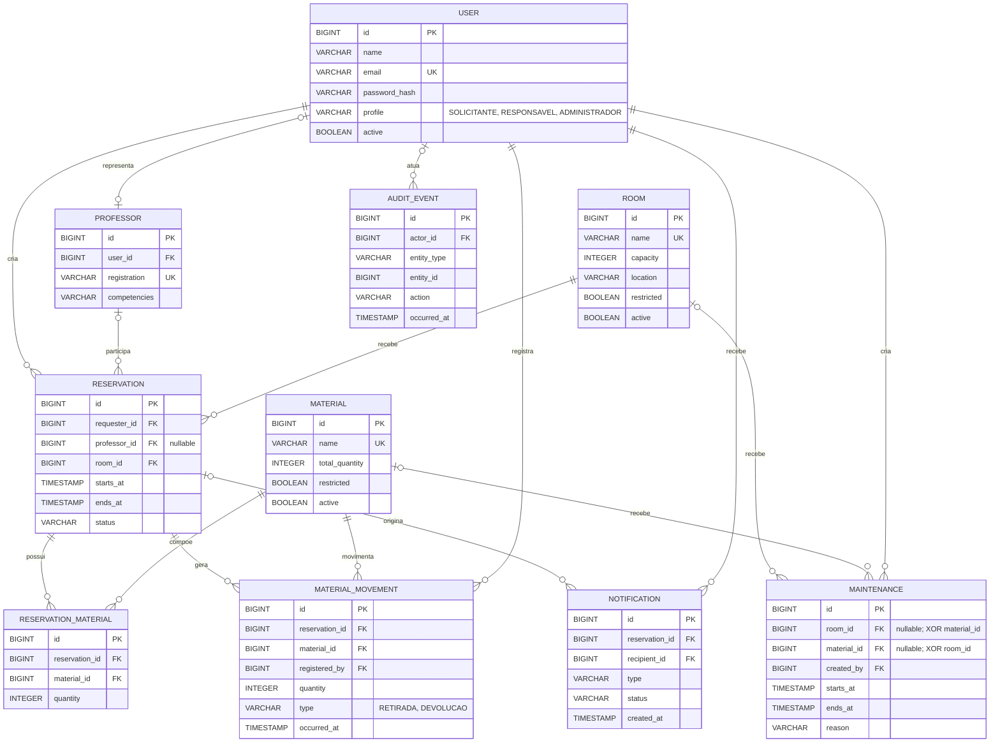

# Documentação Arquitetural e de Dados (`[GOV-03]`)

## 1. Diagrama de Contexto (C4 - Nível 1)

## 2. Diagrama de Componentes (C4 - Nível 3)

## 3. Diagrama Entidade-Relacionamento

## Regras complementares

- `ReservationMaterial` registra a quantidade de cada material solicitado;
- cada manutenção afeta exatamente uma sala ou um material, nunca ambos;
- intervalos são semiabertos: `[início, término)`;
- sala, professor e material não podem possuir sobreposição incompatível;
- movimentações, auditorias, notificações e reservas históricas não são apagadas fisicamente;
- permissões e transições seguem a matriz e a máquina de estados documentadas.
