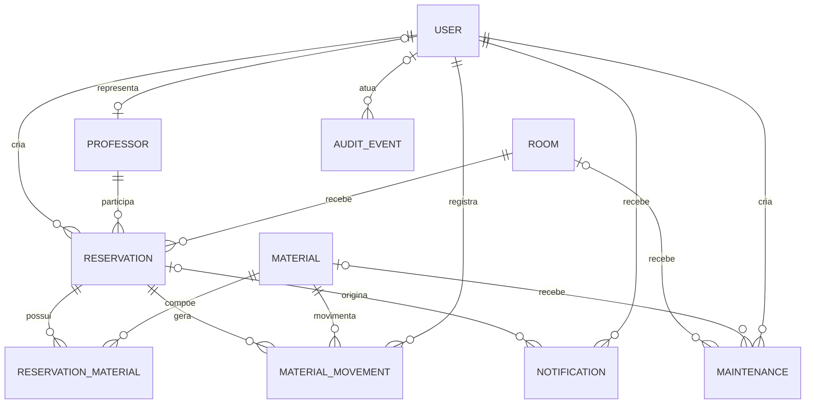

# Diagrama do Modelo de Domínio

## Objetivo

Representar visualmente as entidades e os relacionamentos definidos no modelo de domínio do Gerenciador de Salas de Aula.

O detalhamento dos atributos e regras permanece nos documentos:

- [Modelo de domínio](../arquitetura/MODELO_DE_DOMINIO.md);
- [Entidades de suporte](../arquitetura/ENTIDADES_DE_SUPORTE.md);
- [Estados da reserva](../arquitetura/ESTADOS_DA_RESERVA.md);
- [Matriz de permissões](../seguranca/MATRIZ_DE_PERMISSOES.md).

## Diagrama

## Leitura dos relacionamentos

- um usuário pode criar muitas reservas;
- um usuário pode representar um professor, e um professor pode possuir ou não acesso ao sistema;
- um professor pode participar de muitas reservas;
- uma sala pode aparecer em muitas reservas, desde que não exista sobreposição;
- uma reserva pode solicitar vários materiais;
- `ReservationMaterial` registra a quantidade de cada material;
- uma sala ou material pode possuir vários registros de manutenção;
- cada manutenção afeta exatamente uma sala ou um material;
- como o Mermaid não representa diretamente a restrição XOR, é obrigatório informar somente uma das associações: sala ou material; ambas vazias ou ambas preenchidas são inválidas;
- uma reserva pode gerar várias movimentações de materiais;
- um usuário Responsável registra retiradas e devoluções;
- um evento de auditoria pode possuir um usuário ou ter origem automática no Sistema;
- uma reserva pode originar notificações;
- cada notificação possui um usuário destinatário.

## Restrições não representadas diretamente

O diagrama apresenta cardinalidades estruturais. As seguintes regras dependem de validação de negócio:

- impedir sobreposição de sala e professor;
- impedir quantidade de material acima da disponibilidade;
- impedir reserva durante manutenção;
- exigir aprovação para recursos restritos;
- garantir somente uma aprovação sob concorrência;
- validar propriedade e perfil;
- permitir somente as transições de estado documentadas;
- preservar movimentações, auditorias e reservas históricas.
